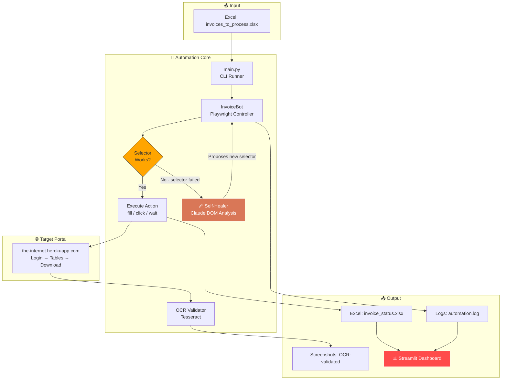
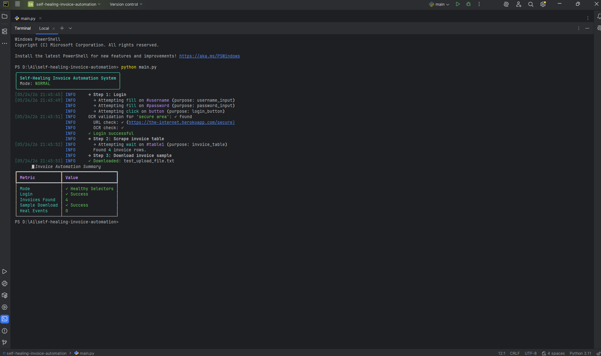
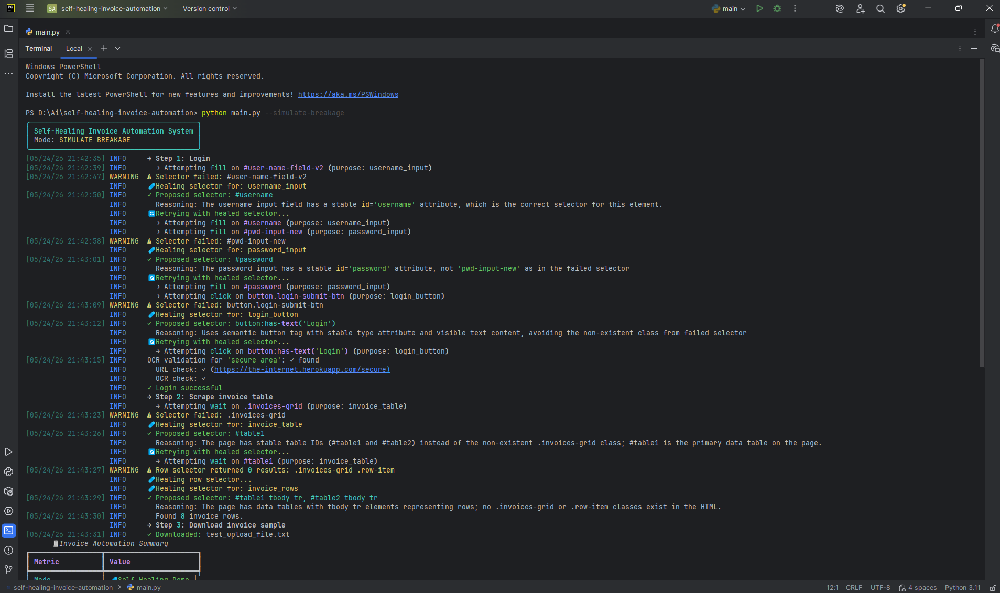
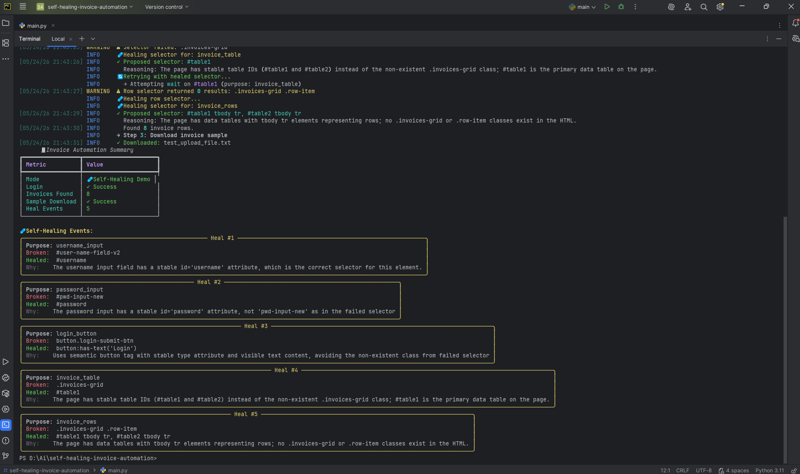
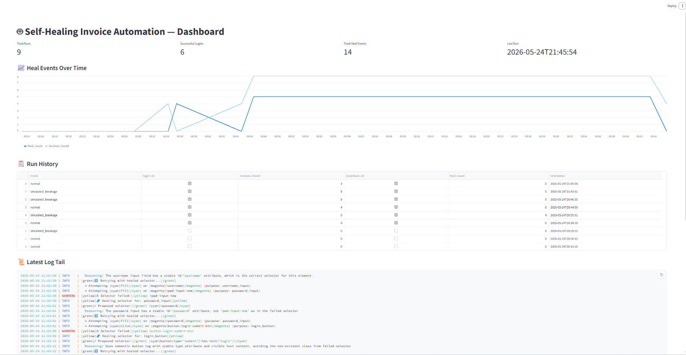

# 🤖 Self-Healing Invoice Automation System

> **Browser automation that fixes itself.** When portal selectors change overnight — a button gets renamed, a DOM gets restructured — this bot detects the failure, asks Claude to analyze the new DOM, and recovers in real time. Zero manual fixes.


---

## 💥 Why This Matters

Traditional RPA bots break the moment a portal's UI changes. A single renamed `id` attribute can take down an entire automation pipeline — and the fix usually means a developer manually re-mapping selectors at 3am.

This system uses an LLM as a **runtime selector resolver**: when a selector fails, the bot screenshots the page, hands the DOM to Claude, asks *"where is the login button now?"*, gets back a fresh selector, and retries. The result is automation that survives portal updates that would kill a brittle RPA script.

---

## 📊 Impact at a Glance

| Metric | Traditional RPA | This System |
|---|---|---|
| **Recovery from selector change** | Manual fix (hours) | Automatic (~seconds) |
| **Maintenance after portal update** | Re-map every selector | Zero touch in most cases |
| **Failure surface** | Any DOM change = downtime | Only structural rewrites cause failure |
| **Audit trail** | Often missing | Full Excel + log per run |

---

## 🏗️ Architecture



---

## ⚙️ How Self-Healing Works

1. **Bot attempts a Playwright action** (e.g., `page.click("#login-btn")`)
2. **Selector times out** → Playwright raises `TimeoutError`
3. **Bot captures**: current page HTML, the failed selector, the action's semantic purpose
4. **Claude (Sonnet 4) receives** a prompt containing:
   - The broken selector
   - The element's purpose (`"login_button"`)
   - A trimmed HTML snippet from the live page
5. **Claude returns JSON** with a new selector + reasoning
6. **Bot swaps the selector and retries** (up to N times)
7. **Every heal event is logged** to Excel and visible in the dashboard

The key insight: **the LLM only runs when something breaks.** Healthy paths cost nothing.

---


### Normal Run

```bash
python main.py
```

The bot logs in, scrapes the invoice table, downloads a sample — all in ~10 seconds. Output:



### Self-Healing Demo 🩹

```bash
python main.py --simulate-breakage
```

The config is swapped to use **intentionally wrong selectors**. Watch the bot fail, call Claude, get healed, and complete the run anyway:





### Dashboard

```bash
streamlit run dashboard.py
```



---

## 🚀 Setup

### Prerequisites

- Python 3.10+
- [Tesseract OCR](https://github.com/tesseract-ocr/tesseract) installed (see below)
- An [Anthropic API key](https://console.anthropic.com/)

### Install Tesseract

**Windows:** Download installer from [UB-Mannheim/tesseract](https://github.com/UB-Mannheim/tesseract/wiki). Add install path to PATH **or** set `TESSERACT_CMD` in `.env`.

**Mac:** `brew install tesseract`

**Linux:** `sudo apt install tesseract-ocr`

Verify: `tesseract --version`

### Install the project

```bash
# Clone
git clone https://github.com/YOUR-USERNAME/self-healing-invoice-automation.git
cd self-healing-invoice-automation

# Virtual env
python -m venv .venv
source .venv/bin/activate          # Windows: .venv\Scripts\activate

# Dependencies
pip install -r requirements.txt
playwright install chromium

# Config
cp .env.example .env
# Edit .env and add your ANTHROPIC_API_KEY
```

---

## 💡 Usage

### CLI

```bash
# Healthy run
python main.py

# Self-healing demo
python main.py --simulate-breakage
```

### Dashboard

```bash
streamlit run dashboard.py
```

Opens at `http://localhost:8501`.

---

## 📁 Project Structure

```
self-healing-invoice-automation/
├── src/
│   ├── automation.py        # Playwright bot + heal-on-failure logic
│   ├── self_healer.py       # Claude DOM analysis
│   ├── ocr_validator.py     # Tesseract screenshot validation
│   ├── invoice_tracker.py   # Excel I/O
│   ├── logger.py            # Rich + file logging
│   └── config.py            # Centralized config
├── data/                    # Excel input/output
├── downloads/               # Downloaded "invoices"
├── screenshots/             # OCR validation captures
├── logs/                    # Structured run logs
├── main.py                  # CLI entry
├── dashboard.py             # Streamlit dashboard
├── requirements.txt
└── README.md
```

---

## 🧠 Design Decisions

**Why Playwright over Selenium?** Modern async-friendly API, faster, better waiting primitives, native download handling.

**Why Claude as the healer?** Strong DOM/HTML reasoning + reliable structured JSON output via prompting. Sonnet 4 is the sweet spot for cost vs. capability on this task.

**Why heal *on failure* rather than always?** LLM calls cost money and add latency. The healthy path should be free. The LLM is the safety net, not the steering wheel.

**Why Excel for data instead of a database?** Portability. Reviewers can open the file in seconds, no DB setup needed. The architecture is DB-ready — `invoice_tracker.py` is the only file that would change.

**Why a public practice site as the target?** Real invoice portals (SAP Ariba, Coupa, etc.) require accounts and forbid automation. `the-internet.herokuapp.com` is built for automation practice and produces a reproducible demo any reviewer can run.

---

## 🛣️ Roadmap

- [ ] Multi-portal support via portal-specific config plugins
- [ ] Heal-event learning: cache successful heals so the LLM isn't called twice for the same fix
- [ ] Vision-based heal fallback (Claude with screenshot) when DOM is too JS-heavy
- [ ] Async/parallel invoice processing
- [ ] Docker deployment + scheduled runs (cron / Airflow)
- [ ] Slack notifications on heal events

---

> ⭐ Found this useful? A star helps more than you'd think.
